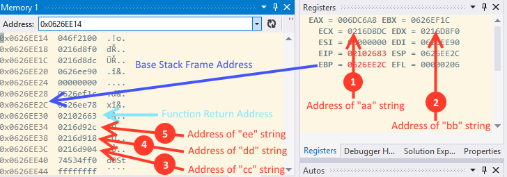

.NET call stack analysis in VS
==============================

Call stack window
-----------------

### Stopping after function return ###

You can place a breakpoint on a stack frame - just select the frame and press F9:


VS will stop when unwinding the stack and you will be able to examine results of the previously called functions (usuall in EAX/RAX register).

### External Code frames in Call Stack ###

Disable Just my Code and they will disappear.

Analyze call stack manually
---------------------------

Look at the sample code below. In subsequent points we will analyze the stack after the Test method was called.

```
private static void Main() {
    Test("aa", "bb", "cc", "dd", "ee");
}

private static void Test(String a, String b, String c, String d, String e) {
    foreach (var s in new[] { a, b, c, d, e }) {
        Console.WriteLine(s);
    }
}
```

### 32bit ###

If we compile the application as a 32bit assembly and step into the Test method the stack might look as follows (we can have this view by dragging EBP registry value in Registers window onto the Memory window):

```
...
0x0626EE24  00000000  ....
0x0626EE28  0626ef1c  .ď&.
0x0626EE2C  0626ee78  xî&.
0x0626EE30  02102663  c&..
0x0626EE34  0216d92c  ,Ů..
0x0626EE38  0216d918  .Ů..
0x0626EE3C  0216d904  .Ů..
0x0626EE40  74534ff0  đOSt
...
```

Our Registers window has the following values:

```
EAX = 006DC6A8 EBX = 0626EF1C ECX = 0216D8DC
EDX = 0216D8F0 ESI = 00000000 EDI = 0626EE90
EIP = 02102683 ESP = 0626EE2C EBP = 0626EE2C
EFL = 00000206
```

CLR calling conventions on 32bit is quite similar to the fastcall convention: two first parameters are passed in ECX and EDX registers,other parameters are pushed to the stack. In our case the decomposition will look as follows:

```
ECX => 0x0216D8DC 21b4 7322 0002 0000  ´!"s....
       0x0216D8E4 0061 0061 0000 0000  a.a.....

EDX => 0x0216D8F0  21b4 7322 0002 0000  ´!"s....
       0x0216D8F8  0062 0062 0000 0000  b.b.....

The Call Stack:

       ...
       0x0626EE24  00000000
       0x0626EE28  0626ef1c
EBP => 0x0626EE2C  0626ee78
       0x0626EE30  02102663
       0x0626EE34  0216d92c => 0x0216D92C  21b4 7322 0002 0000  ´!"s....
                               0x0216D934  0065 0065 0000 0000  e.e.....
       0x0626EE38  0216d918 => 0x0216D918  21b4 7322 0002 0000  ´!"s....
                               0x0216D920  0064 0064 0000 0000  d.d.....
       0x0626EE3C  0216d904 => 0x0216D904  21b4 7322 0002 0000  ´!"s....
                               0x0216D90C  0063 0063 0000 0000  c.c.....
       0x0626EE40  74534ff0
       ...
```

If you prefer visualizations have a look at this diagram:



### 64bit ###

CLR calling convention is very similar to x64 calling conventions. First 4 parameters go to registries: RCX, RDX, R8 and R9. The rest is pushed onto the stack. In our sample the stack might look as follows:

```
...
0x000000293920E588  0000000000000000  ........
0x000000293920E590  0000cefdf5be5b36  6[ľőýÎ..
0x000000293920E598  00007ff8b8380b30  0.8¸ř...
0x000000293920E5A0  000000293920e910  .é 9)...
0x000000293920E5A8  000000293920e600  .ć 9)...
0x000000293920E5B0  000000293920e910  .é 9)...
0x000000293920E5B8  000000293920e778  xç 9)...
0x000000293920E5C0  000000293920e7e8  čç 9)...
0x000000293920E5C8  000000293920e600  .ć 9)...
0x000000293920E5D0  000000293920e888  .č 9)...
...
```

Registers:

```
RAX = 00007FF85855C8E8 RBX = 000000293920E7E8 RCX = 000000291F70BE70 RDX = 000000291F70BE90 RSI = 000000293920E778 RDI = 000000293920E910 R8  = 000000291F70BEB0 R9  = 000000291F70BED0 R10 = 00007FF8586C4BC0 R11 = 000000293920E500 R12 = 000000293920E888 R13 = 000000293920E940 R14 = 000000293920E7E8 R15 = 000000293920E710 RIP = 00007FF858673D3C RSP = 000000293920E5A0 RBP = 000000293920E5A0 EFL = 00000206
```

After decomposing:

```

```

### Inline calls and jumps ###

