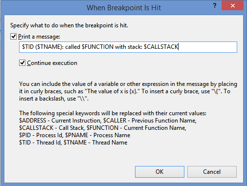

.NET parallel code debugging in VS
==================================

Controlling threads in the debugger
-----------------------------------

Threads window is quite powerful and has some really interesting options. If you are debugging mutli-threaded application it might be useful to run only the interesting ones and stop others. For this purpose use **Freeze** command from the context menu. When the thread is freezed it won't execute after you press F5. To resume it use **Thaw** command. You should only play with threads of Category **Worker Thread** - otherwise you may stop one of the GC threads and break your application. Even if you stick to worker threads, but use tasks, this technique might lead to strange concurrency problems.

Much less invasive method of diagnosing concurrency is to observe the threads execution in the critical parts of our application. For this purpose we can use [tracepoints](vs-breakpoints.md). We can configure the tracepoint to print in the Immediate (or Output) window:

- current thread's ID (special variable `$TID`)
- current thread's name (special variable `$TNAME~`) - by default thread's name is not really interesting, but in the Threads window we have an option to rename a thread (**Rename** command in the context menu)
- current function name (special variable `$FUNCTION`)
- current call stack (special variable `$CALLSTACK`)

Example message text field when setting a tracepoint might look as follows:

Resolve problems with locks
---------------------------

### Find waiting threads ###

The best place to search for blocked threads is the **Parallel Stacks** window. As threads' call stacks are grouped, in a glimpse of an eye you are able to find the critical section or lock which was not properly released (more on this in the next point). If you mark any threads in the Threads window (renamed or flagged them) the marks will be visible also in the Parallel Stacks window.

