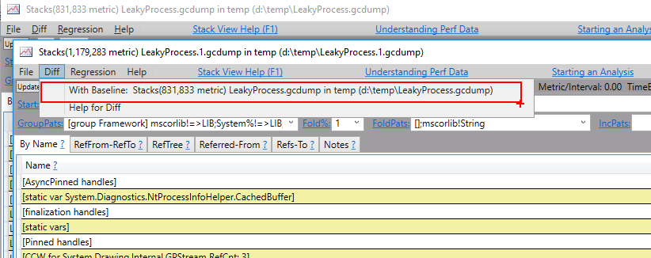

Diagnosing managed memory leaks
==============================

In this recipe:

- [Collect memory snapshot](#collect-snapshot) 
- [Analyse collected snapshots](#analze-snapshots)
  - [Using PerfView (dumps and snapshots)](#perfview)
  - [Using WinDbg (dumps only)](#windbg)

## <a name="collect-snapshot">Collect memory snapshot</a>

To create a memory dump you may use [procdump](https://live.sysinternals.com) or [minidumper](https://github.com/goldshtn/minidumper) - a tool from Sasha Goldshtein (with my contribution):

    procdump -ma <your-app-name-or-pid>

    minidumper -ma <your-app-name-or-pid>

For a GC heap snapshot use **a perfview snapshot**:

    perfview heapsnapshot <pid|name>

You may also use the menu option: **Memory -&gt; Take Heap Snapshot**.

## <a name="analyze-snapshots">Analyse collected snapshots</a>

### <a name="perfview">Using perfview (dumps and snapshots)</a>

You may convert a memory dump file to perfview snapshot using `PerfView HeapSnapshotFromProcessDump ProcessDumpFile [DataFile]` or using the GUI options **Memory -&gt; Take Heap Snapshot from Dump**.

I would like to bring your attention to an excellent diffing option available for heap snapshots. Imagine you made two heap snapshots of the leaking process:

- first named LeakingProcess.gcdump
- second (taken a minute later) named LeakingProcess.1.gcdump

You may now run PerfView, open two collected snapshots, switch to the LeakingProcess.1.gcdump and under the Diff menu you should see an option to diff this snapshot with the baseline:



After you choose it a new window will pop up with a tree of objects which have changed between the snapshots. Of course, if you have more snapshots you can generate diffs between them all. A really powerful feature!

### Using windbg (dumps only) ###

    windbg -z <dump-file>

_Make sure that bitness of the dump matches bitness of the debugger._

When dump was not taken with a full memory you may receive an error similar to the one below:

    0:000> .loadby sos clr
    The call to LoadLibrary(d:\symbols\mss\clr.dll\4DA3FDF5670000\sos) failed, Win32 error 0n126
        "The specified module could not be found."
    Please check your debugger configuration and/or network access.

Identify object which used most of the memory using **!DumpHeap -stat**.

Load necessary **plugins**:

```
.load procdumpext
!loadsos
!loadsosex (or .load sosex)
```

**SOS commands:**

```
!EEHeap [-gc] [-loader]
!HeapStat [-inclUnrooted | -iu]

!DumpHeap [-stat]
          [-strings]
          [-short]
          [-min <size>]
          [-max <size>]
          [-live]
          [-dead]
          [-thinlock]
          [-startAtLowerBound]
          [-mt <MethodTable address>]
          [-type <partial type name>]
          [start [end]]

!ObjSize [<Object address>]
!GCRoot [-nostacks] <Object address>
!DumpObject <address> | !DumpArray <address> | !DumpVC <mt> <address>
```

**SOSEX commands:**

```
!bhi (build heap index) !lhi <file> (load heap index) !chi (close heap index)

!mdt [typename | paramname | localname | MT] [ADDR] [-r[:level]] [-e[:level]]

!mroot
!refs <ObjectAddr> [-target|-source]

!gch [-HandleType]
```

**netext commands:**

```
!windex [/quiet] [/enumtypes] [/tree] [/flush] [/short] [/ignorestate]
        [/withpointer] [/type <string>] [/fieldname <string>]
        [/fieldtype <string>] [/implement <string>] [/save <string>]
        [/load <string>] [/mt <string>]

!wfrom [/nofield] [/withpointer] [/type <string>]
       [/mt <string>] [/fieldname <string>] [/fieldtype <string>]
       [/implement <string>] [/obj <expr>]
       [where (<condition>)] select <expr1>, ..., <exprN>

!wselect [mt <expr>] <field1>, ..., <fieldN> from <obj-expr> | <array-expr>
<field1>, ..., <fieldN> List of fields to display (accepts * and ?)

!wgchandle [-handletype <partial-name-of-handle-type>] [-type <partial-name-of-handle-type>] [-summary]
```

Links
-----

- [.NET Memory Basics](http://www.simple-talk.com/dotnet/.net-framework/.net-memory-management-basics/)
- [Large Obect Heap compaction - should I use it?](https://www.simple-talk.com/dotnet/.net-framework/large-object-heap-compaction-should-you-use-it/)
- Garbage Collection - series on MSDN ([Part 1](http://msdn.microsoft.com/en-us/magazine/bb985010.aspx), [Part 2](http://msdn.microsoft.com/en-us/magazine/bb985011.aspx))
- Defrag Tools ([Part 1](http://channel9.msdn.com/Shows/Defrag-Tools/Defrag-Tools-33-CLR-GC-Part-1), [Part 2](http://channel9.msdn.com/Shows/Defrag-Tools/Defrag-Tools-34-CLR-GC-Part-2))
- GC ETW events by Maoni Stephens (
[Part 1](http://blogs.msdn.com/b/maoni/archive/2014/12/22/gc-etw-events.aspx),[Part 2](http://blogs.msdn.com/b/maoni/archive/2014/12/25/gc-etw-events-2.aspx), [Part 3](http://blogs.msdn.com/b/maoni/archive/2014/12/25/gc-etw-events-3.aspx), [Part 4](http://blogs.msdn.com/b/maoni/archive/2014/12/30/gc-etw-events-4.aspx))
